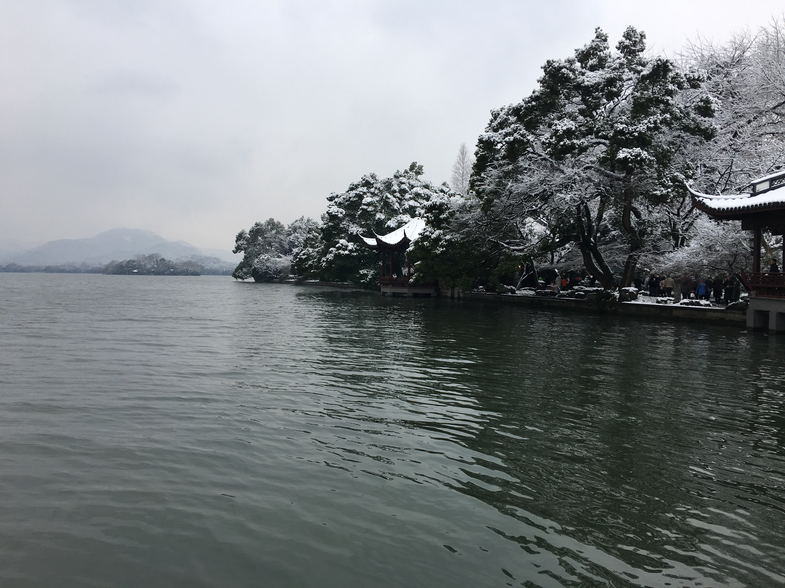
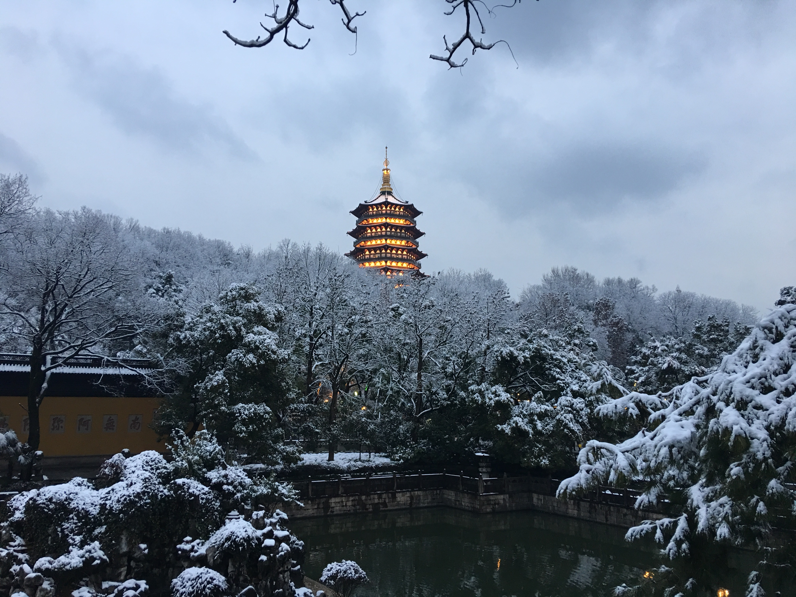
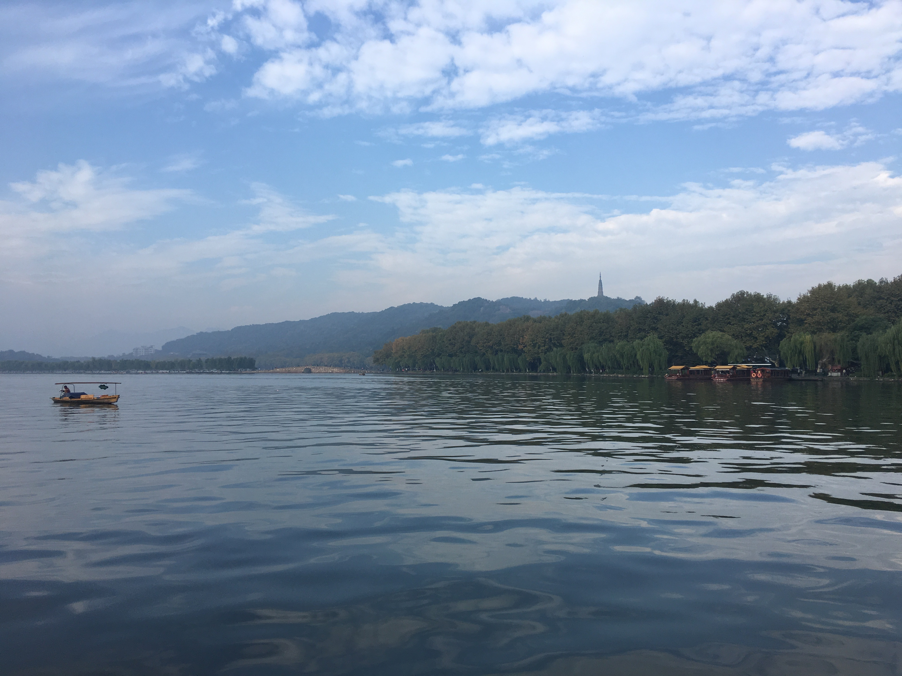

# Introduction of lilydedbb

> The image originates from a Chinese Animation Movie —— *Big Fish and Begonia*. It gives an excellent representation to the leading character —— Chun, a girl fulfilled with love, perseverance and dream.

**One word in the movie leave me a deep impression —— *"爱一个人，攀一座山，追一个梦"*, which in English is *"Love a person. Climb a peak. Pursue a Dream"*. And I always view this word as my style of life.**

I am `lilydedbb`. This name represents my love to Lily, who has been my girlfriend since junior middle school and will be my whole-life wife.

We are ordinary undergraduate, I was in *Huazhong University of Science and Technology* while she is in *Tianjin Normal University*. This website is our daily notes, which records my learning at ordinary times. The fields range from fundamental Data Structure to Machine Learning，from Front-End Development to Programming in Server End，and involving so many many other fields.

The principle of this website is very simple. The whole website is static and I will update its content every few days. All the static pages are generated by a powerful publishing tool —— [GitBook](https://github.com/GitbookIO/gitbook), which is a Modern book format and toolchain using Git and Markdown and the nginx work as reverse proxy. Because I have been engaged in massive annoying things this few months, so I have little time to update this site to a more original version. Thanks for you all-the-time following to my notes.

All the notes were written in the grammar of Markdown, so they could have different appearence when using different Markdown compiler (that's why some notes might be very weird in gitbook and I strongly recommend you to their source code in [Typora](https://typora.io/) where I edited them.). If you like my notes, you can star my [github](https://github.com/lilydedbb/lilydedbb-s-note) repository and the [gitbook](https://legacy.gitbook.com/book/lilydedbb/lilydedbb-s-book/details).

If you're interested in me, you're welcome to add me to your contacts. You can use your cell phone to scan the following QR code.

Now I am a Ph.D Candidate of Computer Science of Zhejiang University, Hangzhou, China. Recently I am mainly working as beginner on Computer Vision, especially objects and keypoints detection.

This is the beautiful $Hangzhou\ West\ Lake$:

IMG_7926](./images/IMG_7926.jpg)

**本博客采用创作共用版权协议, 要求署名、非商业用途和保持一致. 转载本博客文章必须也遵循[署名-非商业用途-保持一致](https://creativecommons.org/licenses/by-nc-sa/3.0/deed.zh)的创作共用协议.**

The catelog is [Here](./README.md).
