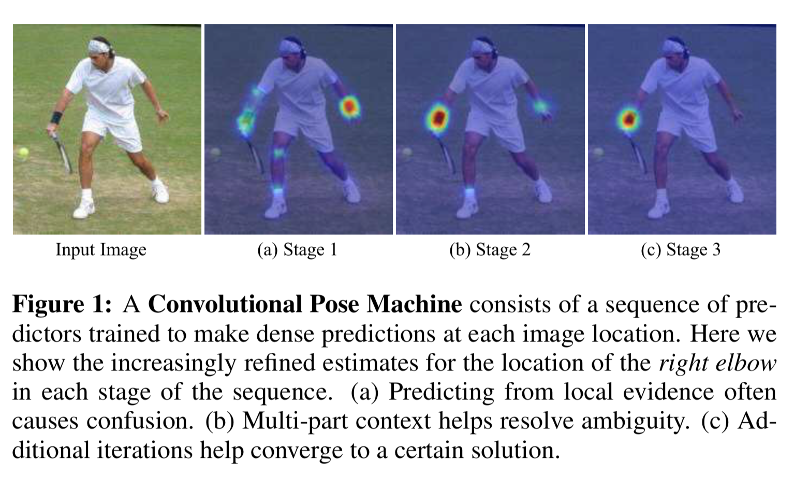
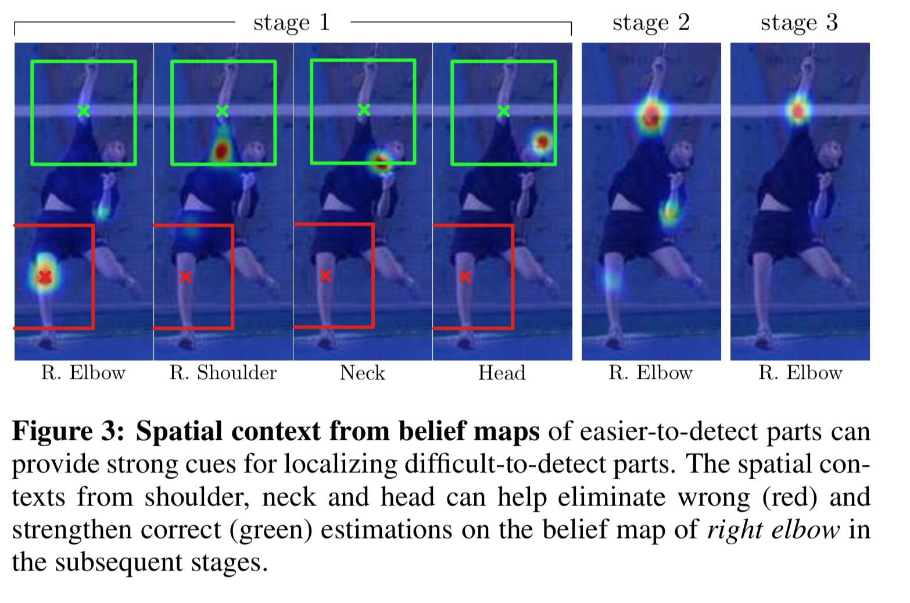
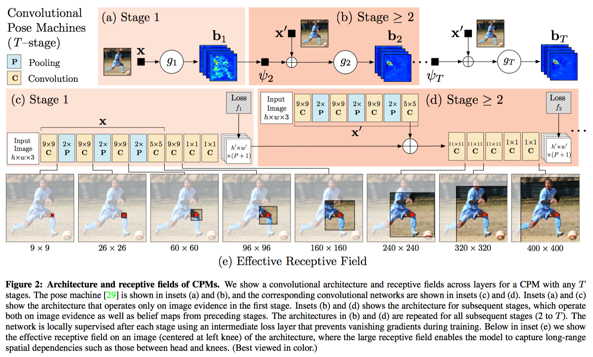
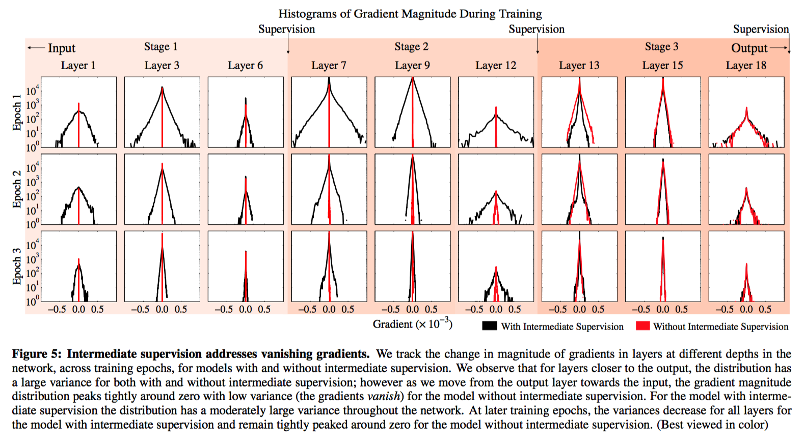

# Convolutional Pose Machines

> We achieve this by designing a **sequential architecture composed of convolutional networks** that directly operate on belief maps from previous stages, producing increasingly refined estimates for part locations, without the need for explicit graphical model-style inference. Our approach **addresses the characteristic difficulty of vanishing gradients** during training by providing a natural learning objective function that enforces intermediate supervision, thereby replenishing back-propagated gradients and conditioning the learning procedure.

如本论文中 $Abstarct$ 所说，$CPM$ 实现了一个多阶段全卷积网络（不需要特定的图结构），每一阶段的网络都利用上一阶段输出的卷积特征图，产生逐级限制的预测结果。并且通过补偿反向传播过程中的梯度，解决了网络很深时梯度消失的问题。

$Figure\ 1$ 展示了 $CPM$ 不同阶段对某一关键点的预测结果。从局部特征中预测的 $right \  elbow$ 关键点很容易和 $left \  elbow$ 相混淆，但是随着特征图经过更多阶段的网络，误检会被逐渐纠正，并且检测的位置会被微调得越来越准确。之所以之后阶段的网络可以改掉一些误检结果，主要得益于随着网络的加深，感知域越来越大。网络只看到 $local \  features$ 时，不能分辨一些极其相似的关键点，比如左右膝盖，左右肘部等；但当网络的感知域扩大到整个躯体的时候，便能够结合近乎 $global$ 的 $features$ 纠正这些误检。$Figure\ 3$ 更好的解释了这一点。可以明显看到，在预测右肘关键点的时候，第一阶段的预测结果非常容易给出膝盖这样的 $fasle \  positive$ ，因为这些关键点仅从局部看，是非常相似的，但第二阶段融合进更加全局的信息之后 $false \ positive$ 被纠正，可以看到膝盖处的热度图值下降了不少，而右肘的热度图值有了明显提高；之后的阶段会逐步在上一阶段的预测结果上进行限制，得到更加精确的定位。

###  网络结构

第一阶段输入原始图片，计算特征图 $X$（论文中一直称其为 $belief \ fetures$），这里的特征图为每个关键点的响应，即特征图的 $channel$ 数等于关键点数，每一层的 $belief \ map$ 负责一个关键点；第二阶段会将原始图片也通过一段网络计算特征图 $X^{\prime}$ ，然后和第一阶段的特征图 $X$（即第一阶段的关键点响应） 与一个中心约束（$center \ map$，是一个提前生成的高斯函数模板，用来把响应归拢到图像中心） 拼接，计算第二阶段的特征图；第二阶段之后网络和第二阶段网络结构一致，并且和第二阶段共享特征图 $X^{\prime}$ ，这也省去不少计算。

### 消除梯度消失

训练很深的网络往往会有梯度消失的问题，因为梯度会随着反向传播，在数值上骤减，造成无法有效训练网络的问题。

为了解决梯度消失，$CPM$ 提出每个阶段都给一个 $loss$（该阶段输出的 $belief \  map $ 和 $ideal \ belief \ map$ ，注：$ideal \ belief \ map$ 为在 $ground \ truth$ 关键点经过高斯滤波之后的一层 $mask$）：

$$f_t = \sum_{p = 1}^{P+1} \sum_{z\in \mathcal{Z}}  \| b^{p}_{t}(z) -  b^{p}_{*}(z)\|^{2}_{2}$$ ，

最终的 $loss$ 为各阶段 $loss$ 之和：

$$\mathcal{F} = \sum_{t = 1}^{T} f_t ​$$

------

### 1. Introduction

CPMs consist of a sequence of convolutional networks that repeatedly produce 2D belief maps 1 for the location 	of each part. At each stage in a CPM, image features and the belief maps produced by the previous stage are used as input. The belief maps provide the subsequent stage an expressive non-parametric encoding of the spatial uncertainty of location for each part, allowing the CPM to learn rich image-dependent spatial models of the relationships between parts. Instead of explicitly parsing such belief maps either using graphical models [28, 38, 39] or specialized post-processing steps [38, 40], we learn convolutional networks that directly operate on intermediate belief maps and learn implicit image-dependent spatial models of the relationships between parts. 

As a result, **each stage of a CPM produces belief maps with increasingly refined estimates for the locations of each part** (see Figure 1).

We find, through experiments, that **large receptive fields on the belief maps are crucial for learning long range spatial relationships and result in improved accuracy**.

Composing multiple convolutional networks in a CPM results in an overall network with many layers that is at risk of the problem of vanishing gradients [4, 5, 10, 12]during learning.

Our main contributions are: 

1. learning implicit spatial models via a **sequential composition of convolutional architectures** 

1. a systematic approach to designing and training such an architecture to learn both image features and **image-dependent spatial models** for structured prediction tasks, **without the need for any graphical model style inference**.

### 3. Method

#### 3.1 Pose Machines

in the first stage $t = 1$, therefore produces the following belief values:

$$g_{1}(\mathbf{x}_z) \rightarrow \left\{ b_1^p( Y_p = z)\right\}_{p \in \{0 \ldots P\}}$$

where $b^{p}_1(Y_p = z)$ is the score predicted by the classifier $g_1$ for assigning the $p^{\mathrm{th}}$ part in the first stage at image location $z$. We represent all the beliefs of part $p$ evaluated at every location $z=(u,v)^T$ in the image as $\mathbf{b}^p_t \in \mathbb{R}^{w \times h}$, where $w$ and $h$ are the width and height of the image, respectively.

$$\mathbf{b}^p_t[u,v] = b^{p}_t(Y_p = z)$$

For convenience, we denote the collection of belief maps for all the parts as $\mathbf{b}_t \in \mathbb{R}^{w \times h \times (P+1)}$ ($P$ parts plus one for background).

In subsequent stages, the classifier predicts a belief for assigning a location to each part $Y_p = z, ~\forall z \in \mathcal{Z},$ based on (1) features of the image data $\mathbf{x}^t_z \in \mathbb{R}^d$ again, and (2) contextual information from the preceeding classifier in the neighborhood around each $Y_p$:

$$g_t \left(\mathbf{x}'_z, \psi_t(z, \mathbf{b}_{t-1}) \right) \rightarrow \left\{ b_t^p( Y_p = z)\right\}_{p \in \{0 \ldots P+1\}}$$

$\psi_{t>1}(\cdot)$ is a mapping from the beliefs $\mathbf{b}_{t-1}$ to context features. In each stage, the computed beliefs provide an increasingly refined estimate for the location of each part. Note that we allow image features $\mathbf{x}'_z$ for subsequent stage to be different from the image feature used in the first stage $\mathbf{x}$.

#### 3.2.1 Keypoint Localization Using Local Image Evidence

The first stage of a convolutional pose machine predicts part beliefs from only local image evidence.

The evidence is $local$ because the receptive field of the first stage of the network is constrained to a small patch around the output pixel location.

In practice, to achieve certain precision, we normalize input cropped images to size $368 \times 368$, and the receptive field of the network shown above is $160 \times 160$ pixels.

### 3.3 Learning in Convolutional Pose Machines

We encourage the network to repeatedly arrive at such a representation by defining a loss function at the output of each stage $t$ that minimizes the $l_2$ distance between the predicted and ideal belief maps for each part. The ideal belief map for a part $p$ is written as $b^{p}_{*}(Y_p = z)$, which are created by putting Gaussian peaks at ground truth locations of each body part $p$. The cost function we aim to minimize at the output of each stage at each level is therefore given by: 

$$f_t = \sum_{p = 1}^{P+1} \sum_{z\in \mathcal{Z}}  \| b^{p}_{t}(z) -  b^{p}_{*}(z)\|^{2}_{2}.$$

The overall objective for the full architecture is obtained by adding the losses at each stage and is given by:

$$\mathcal{F} = \sum_{t = 1}^{T} f_t .$$	

To share the image feature $\mathbf{x}'$ across all subsequent stages, we share the weights of corresponding convolutional layers (see Figure 2) across stages $t \geq 2$

​		
​	

​	

​				
​			
​		
​	

​			
​		
​	

