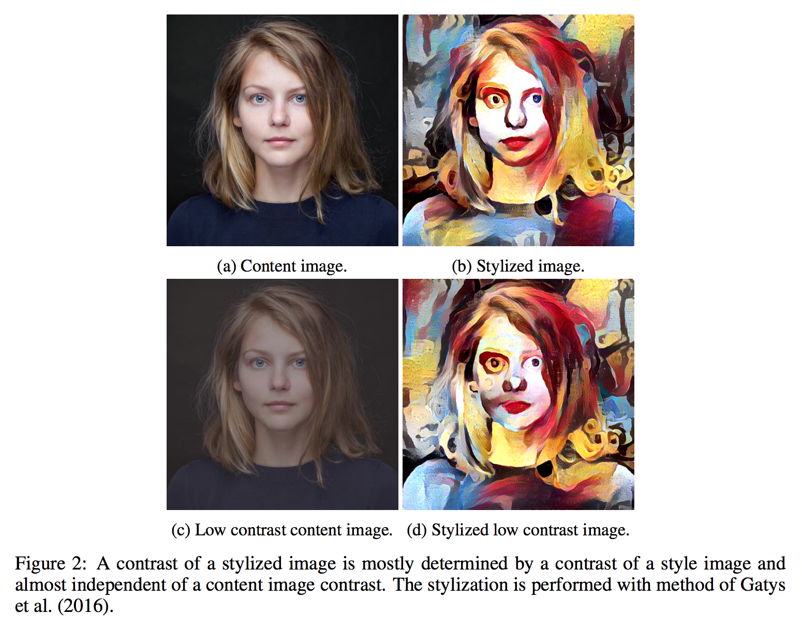

# Instance Normalization: The Missing Ingredient for Fast Stylization

> It this paper we revisit the fast stylization method introduced in Ulyanov et al. (2016). We show how a small change in the stylization architecture results in a significant qualitative improvement in the generated images. The change is limited to swapping batch normalization with instance normalization, and to apply the latter both at training and testing times. The resulting method can be used to train high-performance architectures for real-time image generation. 

$Instance \ Normalization$ 这篇论文的提出，根本目的是提升图像风格迁移的质量。

$Gatys$ 等人得方法已经能产生比较好的结果，但计算效率低下。$Ulyanov$ 和 $ Johnson$，通过学习等效的前馈生成网络试图解决效率低下的问题，但结果质量没有 $Gatys$ 那个较慢方法好。

本论文在 $Ulyanov$ 和 $Johnson$ 的前馈生成网络基础上，做一个小的改进，即将 $Batch \ Normalization$ 替换为 $Instance \ Normalization$ ，使结果有了很大提升。

**风格迁移：**

经过风格迁移的图片，同时符合风格图片（$style \ image$） 和内容图片 $content \ image$ 的统计分布。风格特征往往从较浅层特征中提取，并且在空间位置上是均匀的，可以代表风格图像的“纹理”；而内容特征则从较深层的特征提取，并且保留了空间位置的信息，即内容图像的“结构”。

**风格迁移中生成网络 $generative \ network$：**

Ulyanov et al. (2016) 证明了生成网络 $g(\mathbf{x},\mathbf{z})$，可以经过训练对任意输入图像 $\mathbf{x}$ 添加 $\mathbf{x_0}$ 的风格的，其中风格图 $\mathbf{x_0}$ 是固定的，变量 $\mathbf{z}$ 是一个随机种子，用来对风格特征取样。

训练 $g(\mathbf{x},\mathbf{z})$ 的目标为：
$$
\min_{g} \frac{1}{n} \sum_{t=1}^n
\mathcal{L}(\mathbf{x_0},\mathbf{x_t},g(\mathbf{x_t},\mathbf{z_t}))
$$
$\mathbf{x_0}, \mathbf{x_t}, g(\mathbf{x_t}, \mathbf{z_t})$ 分别代表风格图片、内容图片、经过风格化的内容图片的分布，这里的损失函数即比较他们之间的统计分布。

Ulyanov et al. (2016) 同时发现一个网络被用16张图片训练，往往会比用1000张图片训练产生更好的结果。在他们的论文中，最好的结果都是从非常少量的训练集中，提前很早停止训练过程得来的。

Ulyanov et al. (2016) 的工作的另一个贡献就是，解决了【但是好像是稀里糊涂解决的】风格迁移生成网络对于内容图片的对比度的依赖或者说敏感度（我们需要的风格迁移网络应该对于内容图片的对比度不敏感才对，即应该只关注内容图片中的“结构”）。可以看到 Ulyanov et al. (2016) 之前更早的 Gatys et al. (2016). 提出的网络对于内容图片的很敏感。

​			
​		
​	

Ulyanov et al. (2016) 提出的生成网络使用卷机、池化、上采样、BN。实际中很难通过这些层去实现一个可以对对比度归一化的非线性映射 $y_{tijk} =  \frac{x_{tijk}}{\sum_{l=1}^W \sum_{m=1}^H x_{tilm}}$。

然而 $BN$ 算法：
$$
y_{tijk} =  \frac{x_{tijk} - \mu_{i}}{\sqrt{\sigma_i^2 + \epsilon}},
\quad
\mu_i = \frac{1}{HWT}\sum_{t=1}^T\sum_{l=1}^W \sum_{m=1}^H x_{tilm},
\quad
\sigma_i^2 = \frac{1}{HWT}\sum_{t=1}^T\sum_{l=1}^W \sum_{m=1}^H (x_{tilm} - mu_i)^2.
$$
和 $y_{tijk} =  \frac{x_{tijk}}{\sum_{l=1}^W \sum_{m=1}^H x_{tilm}}$ 唯一的区别就在于，$BN$ 的归一化过程针对整个 $batch$ ，但是我们需要的是针对单一图像的，因为 $IN$ 作者提议用 $IN$ 代替 $BN$ ：
$$
y_{tijk} =  \frac{x_{tijk} - \mu_{ti}}{\sqrt{\sigma_{ti}^2 + \epsilon}},
\quad
\mu_{ti} = \frac{1}{HW}\sum_{l=1}^W \sum_{m=1}^H x_{tilm},
\quad
\sigma_{ti}^2 = \frac{1}{HW}\sum_{l=1}^W \sum_{m=1}^H (x_{tilm} - mu_{ti})^2.
$$
为什么 $IN$ 可以在 style transfer 领域大放异彩？

1. 通过调整BN统计量，或学习的参数beta和gamma，BN可以用来做domain adaptation。
2. Style Transfer是一个把每张图片当成一个domain的domain adaptation问题。（Style Transfer 本质是将生成图片的deep activation分布和style image的分布进行匹配）

------

### 1. Introduction

**The stylized image matches simultaneously selected statistics of the style image and of the content image.**

**The style statistics are extracted from shallower layers and averaged across spatial locations whereas the content statistics are extracted form deeper layers and preserve spatial information.** In this manner, the style statistics capture the “texture” of the style image whereas the content statistics capture the “structure” of the content image.

The key idea (section 2) is to replace batch normalization layers in the generator architecture with instance normalization layers, and to keep them at test time (as opposed to freeze and simplify them out as done for batch normalization).

### 2. Method

The work of Ulyanov et al. (2016) showed that it is possible to learn a generator network $g(\mathbf{x},\mathbf{z})$ that can apply to a given input image $\mathbf{x}$ the style of another $\mathbf{x_0}$, reproducing to some extent the results of the optimization method of Gatys~et al. Here, the style image $\mathbf{x_0}$ is fixed and the generator $g$ is learned to apply the style to any input image $\mathbf{x}$. The variable $\mathbf{z}$ is a random seed that can be used to obtain sample stylization results.

A simple observation is that the result of **stylization should not, in general, depend on the contrast of the content image**. 

The generators used in Ulyanov et al. (2016) and Johnson et al. (2016) use convolution, pooling, upsampling, and batch normalization.In practice, it may be difficult to learn a highly nonlinear contrast normalization function as a combination of such layers. To see why, let $x\in\mathbb{R}^{T \times C \times W \times H}$ be an input tensor containing a batch of $T$ images. Let $x_{tijk}$ denote its $tijk$-th element, where $k$ and $j$ span spatial dimensions, $i$ is the feature channel (color channel if the input is an RGB image), and $t$ is the index of the image in the batch. Then a simple version of contrast normalization is given by: 
$$
y{tijk} =  \frac{x{tijk}}{\sum{l=1}^W \sum{m=1}^H x_{tilm}} (1)
$$
The key difference between (1) and batch normalization is that the latter applies the normalization to a  whole batch of images instead for single ones:
$$
y_{tijk} =  \frac{x_{tijk} - \mu_{i}}{\sqrt{\sigma_i^2 + \epsilon}},
\quad
\mu_i = \frac{1}{HWT}\sum_{t=1}^T\sum_{l=1}^W \sum_{m=1}^H x_{tilm},
\quad
\sigma_i^2 = \frac{1}{HWT}\sum_{t=1}^T\sum_{l=1}^W \sum_{m=1}^H (x_{tilm} - mu_i)^2.
$$

In order to combine the effects of instance-specific normalization and batch normalization, we propose to replace the latter by the $instance \ normalization$ (also known as "contrast normalization'') layer:
$$
y_{tijk} =  \frac{x_{tijk} - \mu_{ti}}{\sqrt{\sigma_{ti}^2 + \epsilon}},
\quad
\mu_{ti} = \frac{1}{HW}\sum_{l=1}^W \sum_{m=1}^H x_{tilm},
\quad
\sigma_{ti}^2 = \frac{1}{HW}\sum_{l=1}^W \sum_{m=1}^H (x_{tilm} - mu_{ti})^2.
$$

### 4. Conclusion 

In this short note, we demonstrate that by replacing batch normalization with instance normalization it is possible to dramatically improve the performance of certain deep neural networks for image generation.

