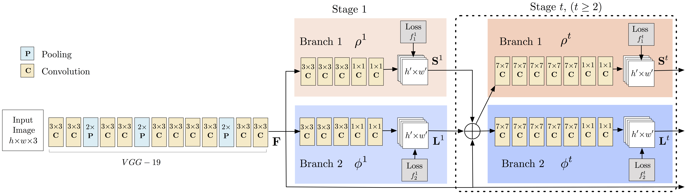

# Realtime Multi-Person 2D Pose Estimation using Part Affinity Fields

网络结构如下图。其中，通过多阶段网络来 refine estimation 的思想来自于 [Convolutional Pose Machines](https://arxiv.org/abs/1602.00134)。

输入图像经过10层卷积网络（VGG-19 的前10c层网络）的处理之后生成的 feature maps $F$ 作为第一阶段的输入。第一阶段的的网络非为两个分支，一个分支负责预测 confidence maps $S^t$ ，另一个分支预测 PAFs $L^t$。从第一阶段之后，前一阶段的输出 $S^t$ 和 $L^t$ 和 feature maps $F$ 拼接起来作为下一阶段的输入。

如同 [Convolutional Pose Machines](https://arxiv.org/abs/1602.00134) 每一阶段的网络都产生一个 loss，用来避免网络过深造成的梯度消失。只不过每一阶段的 loss 包含两部分，每一个分支分别产生一个 loss。

$\mathbf{W}$ 是一个二值 mask ，如果像素 $\mathbf{p}$ 位置没有标签则 $\mathbf{W}(\mathbf{p}) = 0$，否则为 $1$。